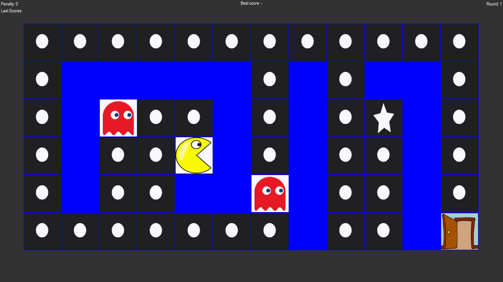

# PacMan with TD(0) Online Learning

## Project Description

This project implements a simplified PacMan environment featuring static enemies (ghosts) and collectible items. The primary objective is for PacMan to collect as many points as possible and reach the goal state while avoiding ghosts. The environment is designed for experimenting with reinforcement learning in large state spaces using **TD(0) learning in its online version**.

The grid world contains different types of cells:

- `.` = Dot (penalty: -1)
- `*` = Star (penalty: -10)
- `G` = Ghost (terminal state, penalty: 100)
- `E` = Exit (terminal state, no reward)
- ` ` = Empty cell (penalty: 1 for moving)
- Walls are impassable and implicitly defined

Only one action is allowed per step, and each action deterministically moves PacMan in the chosen direction (left, right, up, or down). Invalid actions (e.g., into walls) result in no movement.

## Learning Approach

The game is designed for **TD(0)** learning (Temporal Difference learning with λ = 0) and **online learning**. That means the agent improves its policy directly through interaction with the environment, without building a full value table for all possible states.

## User Interface (UI)

The game uses **Pygame** for a simple graphical interface:

- PacMan is displayed in a grid with visual tiles for dots, stars, ghosts, and the goal.
- Top-left corner displays the current penalty.
- A score history is shown on the left with an average score.
- The current round and best score are displayed at the top.

## Code Overview

- PacMan can move in **four directions**: left, right, up, down.
- The environment provides **sensory input** about adjacent tiles, which includes whether the move is terminal and its associated penalty/reward.
- The game keeps track of **penalty scores** per round, displaying recent and average scores.
- This setup allows easy integration of a learning agent (TD(0) or similar), since the environment gives structured feedback and terminal conditions.

